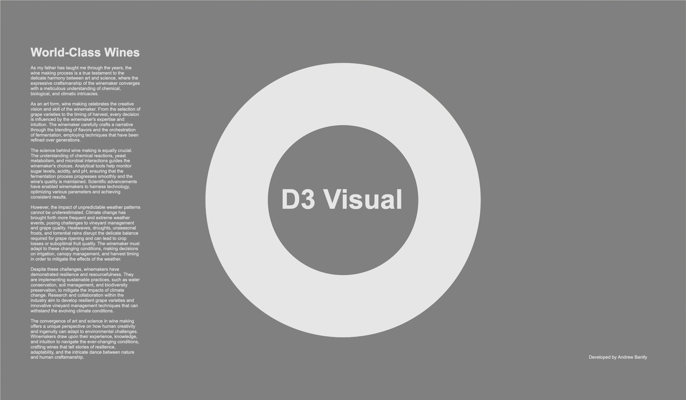

# World Class Wines

[Deployed link](https://andrewbantly.github.io/world-class-wines)

## Project objective

The primary objective of this project is twofold: to acquire proficiency in a new technology - D3.js - and to construct a captivating and dynamic data visualization centered around a subject matter that resonates with me.

## Background
As my father has taught me through the years, the wine making process is a true testament to the delicate harmony between art and science, where the expressive craftsmanship of the winemaker converges with a meticulous understanding of chemical, biological, and climatic intricacies.

The result is a sensorial experience that transcends mere liquid in a glass, captivating enthusiasts and connoisseurs alike with its depth, complexity, and ability to reflect the land, the climate, and the hands that crafted it.

To celebrate the world's exceptional winemakers, it is only fitting to weave together the threads of art and science using the powerful visualization library, D3.js. 

## D3.js
For my culminating project as a General Assembly fellow, I am challenging myself to create an application that features [D3.js](https://d3js.org/), a JavaScript library. 

D3.js revolutionizes the way we interact with data, allowing seamless integration of data into the Document Object Model (DOM) and enabling data-driven transformations using the full potential of HTML, SVG, and CSS. With its lightweight nature and remarkable speed, D3.js effortlessly handles vast datasets, while its dynamic capabilities facilitate engaging interactions and captivating animations.

## Implementing D3.js

Leveraging [Observable](https://observablehq.com/) as a educational and development platform, I'm eager to learn how to work with data in a dynamic way. Observable offers [tutorials](https://observablehq.com/tutorials) and [forkable notebooks](https://observablehq.com/explore) to work with.

Logistically, in order to successfly learn and implement D3.js technology, I will need to minimally:
1. Familiarize myself with the D3.js documentation and resources to gain an understanding of its core concepts, features, and usage. 
1. Develop a viable understanding of working with D3 on the Observable platform
1. Collect raw data and generate organized ```json``` or ```csv``` files to attach to the notebook or fetch from GitHub, both I believe are an acceptable approach with this dataset size. 

*Note: I have demonstrated the ability to produce a csv file based on response data from a* ```GET``` *API call in Python.*

4. Fork and modify a Observable notebook template using collected wine data
1. Download and transfer Observable code to project files and deploy.

## Observable notebook

[Zoomable Sunburt](https://observablehq.com/@d3/zoomable-sunburst)

## Data source
* [Red wines](https://api.sampleapis.com/wines/reds)
* [White wines](https://api.sampleapis.com/wines/whites)
* [Sparkling wines](https://api.sampleapis.com/wines/sparkling)
* [Rose wines](https://api.sampleapis.com/wines/rose)
* [Port wines](https://api.sampleapis.com/wines/port)
* [Dessert wines](https://api.sampleapis.com/wines/Dessert)


## Wireframe


## User stories
* As a user, I want to see proportional data of world-class wines in an attractive and dynamic way
* As a user, I want to learn about world-class wines by interacting with visualized data
* As a user, I want to gain a greater appreciation for winemaking

## MVP Goals
* Develop a data-driven document (D3.js) 
* Deploy an app that hosts the data-driven document 
* Sleek styling

## Stretch Goals
* Refactor my app to Next.js or React.js

## Sprints

Friday, May 20:
* Get project approved 
* Review D3 and Observable documentation
* Fork and read through code of template notebook, create comments in code of functionality

Saturday, May 21:
* Out of office (friend's wedding)

Sunday, May 22:
* Work hands-on with template notebook, create commends in code of observations 
* Collect and organize data into a ```json``` 
* Integrate data into notebook

Monday, May 23:
* Integrate data into notebook (cont'd)

Tuesday, May 24:
* Transfer code to application 

Wednesday, May 25:
* Debug and/or refactor where necessary 
* App styling

Thursday, May 26:
* Deploy

## Tech Stack

```
HTML
CSS
JavaScript
D3.js
```